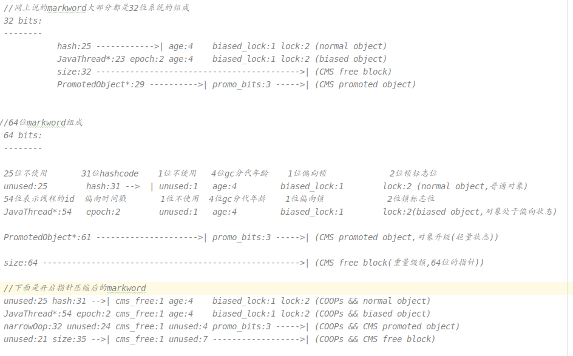
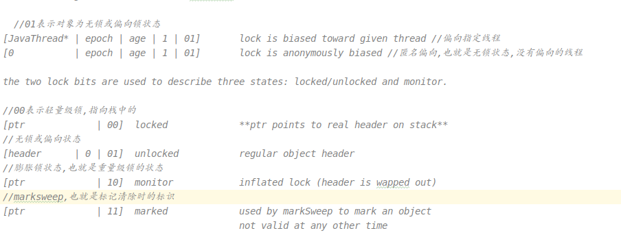
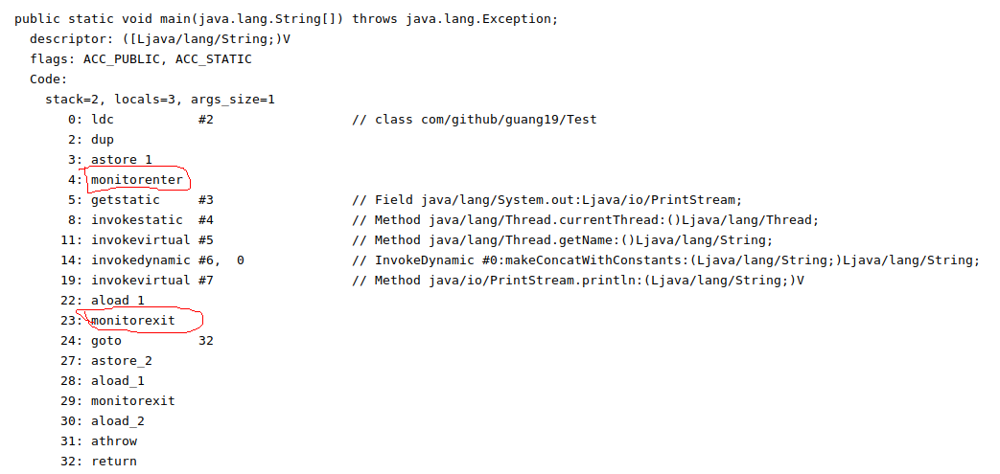
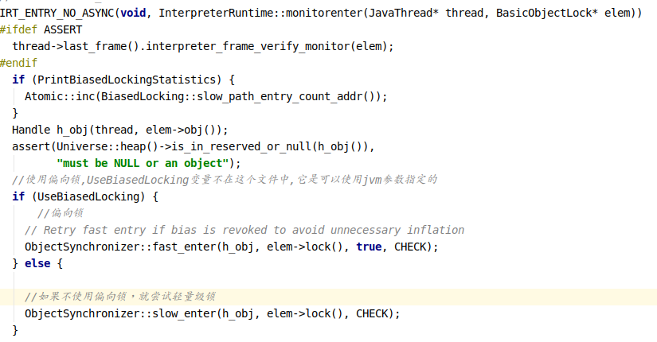
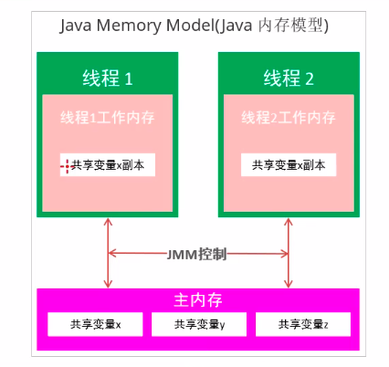
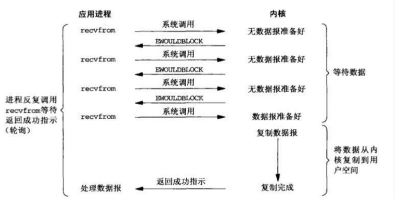
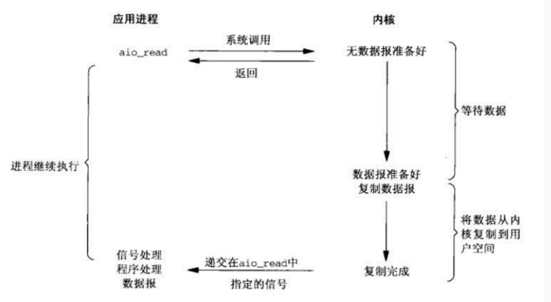
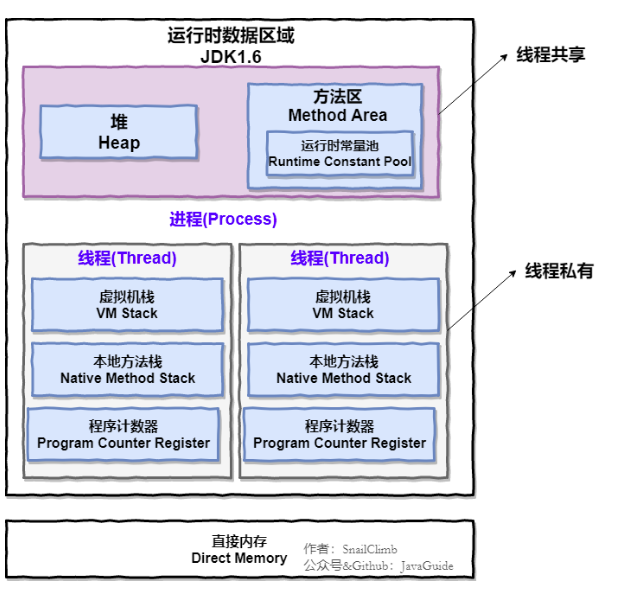
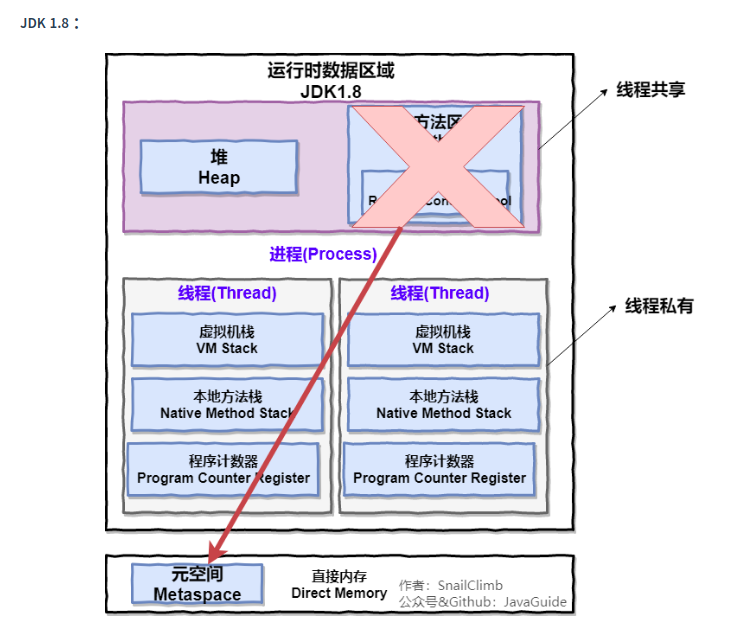

# java基础知识(部分图源:[JavaGuide](https://github.com/Snailclimb/JavaGuide))

复习java基础知识的笔记   

### Java引用类型    

#### 强引用:
>一般常用的new方式创建对象,创建的就是强引用. 只要强引用存在,
>垃圾回收器就不会回收.        

#### 软引用
>SoftReference , 非必须引用,如果内存足够或正常,就不回收,但是当
>内存不够,快发生OOM的时候就回收掉软引用对象.

#### 弱引用
>WeakReference , 对于弱引用的对象来说,只要垃圾回收器开始回收,
>无论空间是否充足,都回收弱引用的对象.
        
#### 虚引用(幽灵引用)
>和其他几种引用不同,虚引用不会决定对象生命周期,垃圾回收时,无法通过虚引用获取对象
>值.虚引用在任何时候都可能被垃圾回收掉.虚引用必须和引用队列(ReferenceQueue)使用.   
      
#### 软引用,弱引用,虚引用在被GC前会被加入到与其关联的引用队列中.  

### 进程和线程:

>进程与线程最主要的区别是它们是操作系统管理资源的不同方式的体现。
准确来说进程与线程属于衍生关系。
进程是操作系统执行程序的一次过程,在这个过程中可能会产生多个线程。比如在使用QQ时，有窗口线程，
>文字发送的线程，语音输入的线程，可能不是很恰当，但是就是这个意思。
在Java中，一个进程产生的多个线程共享这个进程内的堆，metaspace等共享资源，
>每个线程又有自己的程序计数器，虚拟机栈，本地方法栈。
由于系统在线程之间的切换比进程之间的切换更加轻量，所以线程也被成为轻量级进程。

#### 线程的几种状态(见:jdk Thread类源码中的state枚举类)
     NEW,RUNNABLE,BLOCKED,WAITING,TIMED_WAITING,TERMINATED

#### 并发和并行:
1. 并发: 多个线程被一个cpu轮流执行，注意，这里并不是规定一个cpu，多个cpu也是可以的，并发主要强调的是cpu有处理多个任务的能力。
2. 并行:多个线程被多个cpu同时执行，这里也并不是规定要多个cpu，一个cpu也是可以的，只要你的cpu能在同一时刻处理多任务，并行强调的是拥有同时处理多任务的能力。

#### sleep方法和wait方法            
1. sleep方法是Thread类的方法，而wait方法是Object类的方法

2. sleep方法会使当前线程让出cpu的调度资源，
从而让其他线程有获得被执行的机会，但是并不会让当前线程释放锁。
而wait方法是让当前线程释放锁并进入wait状态，
不参与获取锁的争夺，从而让其他等待资源的线程有机会获取锁，
只有当其他线程调用notify或notifyAll方法是，
被wait的线程才能重新与其他线程一起争夺资源。
  
#### stop,suspend,resume等方法为什么会被遗弃
stop:
>stop方法被弃用很好理解，因为stop方法是强行终止线程的执行，
不算线程的run方法是否执行完，资源是否释放完，它都会终止线程的运行，
并释放锁。这在设计上就不合理，不说资源浪费等问题，
它都有可能造成数据的不一致，假设A线程被用于a用户向b用户转账，
那么钱刚从a用户的账户里扣除，线程就被stop了，
b用户却没收到钱，然后其他线程又继续执行其它的操作，这根本上就是不被允许的。  

suspend和resume
>suspend方法用于阻塞一个线程,但并不释放锁，
>而resume方法的作用只是为了恢复被suspend的线程。

>假设A，B线程都争抢同一把锁，A线程成功的获得了锁，
>然后被suspend阻塞了，却并没有释放锁，它需要其他线程来唤醒，
>但此时B线程需要获得这把锁才能唤醒A，所以此时就陷入了死锁.

>这也是它们为什么被弃用的原因。   
          
#### interrupt,interrupted,isInterrupted方法别搞混了
interrupt:
>这个方法并不是中断当前线程，而是给当前线程设置一个中断状态。

isInterrupted:
>当线程调用interrupt方法后，线程就有了一个中断状态，
>而使用isInterrupted方法就可以检测线程的中断状态。

interrupted：
>这个方法用于清除interrupt方法设置的中断状态。
>如果一个线程之前调用了interrupt方法设置了中断状态，
>那么interrupted方法就可以清除这个中断状态。          
 
#### join方法
>join方法的作用是让指定线程加入当线程执行。
>
>假如在main方法里面创建一个线程A执行，并调用A的join方法，
>那么当前线程就是main，指定的A线程就会在main之前执行，
>等A执行完后，才会继续执行main。
>
>join方法的底层是wait方法，
>调用A线程(子线程)的join方法实际上是让main线程wait，
>等A线程执行完后，才能继续执行后面的代码 
            
#### yield方法
>yield属于Thread的静态方法，
>它的作用是让当前线程让出cpu调度资源。
>yield方法其实就和线程的优先级一样，你虽然指定了，
>但是最后的结果不由得你说了算，
>即使调用yield方法，最后仍然可能是这个线程先执行，
>只不过说别的线程可能先执行的机会稍大一些。

---

#### PS:以下内容希望各位同学下载openjdk的源码,亲自下载jvm的源码:[openjdk8u](http://hg.openjdk.java.net/jdk8u/hs-dev/hotspot/archive/tip.tar.gz)并阅读

### 对象在内存中的布局(64位)
ps:对象在内存中的布局,在32位和64位上的实现也是不同的，以我的
机器为例(64位)

>对象在内存中由 对象头,实例数据,对齐填充三部分组成。


    
#### 对象头
>对象头可以分为2部分数据组成.
>(如果是数组,对象头还会保存数组长度)

可以看到在hotspot虚拟机中的对象头由2部分组成:
mark 和 metadata(klass* , compressed_klass)
(见oop.hpp文件):


下面是mark/markword的组成(见:markOop.hpp头文件)


对象处于每种状态时的锁标志位都不同(见:markOop.hpp头文件):



##### 1. Mark Word(mark):

| 锁状态    | markword组成      |
| :---:    | :---:    |
|无锁   01    | 由hashcode,分代年龄,偏向锁,锁标志位组成 |
|偏向锁 01    | 由偏向线程的ID,偏向时间戳(epoch),偏向锁,分代年龄,锁标志位组成|
|轻量级锁 00 | 由指向栈中锁的记录和锁标志位组成 |
|膨胀锁 10   |  由指向锁的指针和锁标志位组成   |
| GC 11     | 无数据  |                               
           
##### 2. Klass Pointer /  Compressed Klass:
>Klass Pointer是指向对象类型的指针，指针指向对象的类元数据。
>jvm通过klass pointer判断对象属于那个类。
>
>在64位的jvm实现中，Klass Pointer的长度为64bit(32位系统,
>指针为32bit)，也就意味着,64位系统比32位的系统占用更多内存。
>jvm提供了压缩指针(Compressed Klass)，可以使用-XX:+UseCompressedOops
>来开启指针压缩。
           
#### 实例数据:
>实例数据存储着对象在程序中被定义的各个字段的数据,也就是对象的字段的
>数据.
        
#### 对齐填充
>Java对象的小必须是8字节的倍数,像13,15这种非8的倍数的对象的大小,
>不足或多余的部分就要使用对齐填充数据补齐.
>如果Java对象大小正好是8的倍数,那么就无需对齐填充数据

PS: 可以使用openjdk-jol工具查看对象大小

### synchronized

#### 谈谈 synchronized 关键字
>synchronized关键字是jdk提供的jvm层面的同步锁.
>它解决的是多线程之间访问共享资源的同步性,它保证了
>在被它修饰的方法或代码块只有一个线程执行.
>
>java6之前的synchronized属于重量锁,性能较差.
>它的原理是基于操作系统的Mutex Lock互斥量实现的
>因为java线程是映射到操作系统的线程之上的,所以
>暂停或唤醒线程都需要操作系统帮忙,而操作系统实现
>线程之间的切换需要从用户态转换为内核态,这段
>转换时间消耗较长.
>
>java6之后jvm团队对synchronized做出了非常大的
>优化.

#### synchronized底层原理
先看我编写的一段测试代码:


使用 javap -c -v -l 指令反编译 class文件后的 **字节码指令** 如下



>可以清楚的看到,在进入synchronized的时候，底层字节码编译出来的指令为
>**monitorenter**,在执行完同步代码块后又有一个**monitorexit**指令.

想了解synchronized究竟是如何实现的,可以直接进入openjdk:src/share/vm/runtime 目录,这个目录存放的是hotspot虚拟机在运行时
所需的代码.

>可以直接锁定其中的 objectMonitor.cpp源文件和objectMonitor.hpp头文件.
>看到这2个文件，相信各位同学应该就知道，这个就是synchronized锁对象的monitor，它也是
>一个对象,不过它是一个c++对象(见:objectMonitor.hpp头文件):

 

>其实真正的锁应该是这个monitor,synchronized锁的那个对象起到的只是关联monitor的作用。
>只不过我们身在java层面，无法感知到monitor的作用，所以才称synchronized的锁对象为锁。

以下是monitorenter指令执行过程(见 InterpreterRuntime.cpp):



PS:本来想真正弄清楚fast_enter(偏向锁的实现),slow_enter(轻量级锁实现)和inflate(膨胀锁实现)
的,无奈看不太懂cpp源码，但是有的地方是可以根据语义来推断的。

>这里做一个总结吧,这个总结可能不太准确，但大致是这样的:
>每次执行monitorenter指令的时候,是将当前synchronized锁对象
>关联的**monitor**的_recursions加1,
>执行monitorexit指令的时候,将当前object对象关联的**monitor**的_recursions减1,
>当_recursions为0的时候，就说明线程不再持有锁对象。

>PS:如果熟悉AQS原理的同学就知道在AQS内部，有一个被volatile修饰state变量，
>这个state变量就是AQS的核心，state变量的作用类比到此处就是monitor计数器的作用。

#### synchronized 使用方法
##### 1. 修饰静态方法
>修饰静态方法是给类加锁,会作用于所有对象,因为静态方法属于类,
>而不属于对象,不管有多少个对象,static方法都是共享的.
       
##### 2. 修饰实例方法
>修饰实例方法是给对象加锁,会作用于当前类的实例对象.      

##### 3. 修饰代码块
>修饰代码块,根据代码块给定的对象加锁,线程想要进入代码块,只能获取
>指定的对象的锁.

#### Synchronized和ReentrantLock的区别

##### 1.Synchronized基于jvm层面,ReentrantLock基于java层面.
  
##### 2.ReentrantLock提供了更高级的功能
1. synchronized是基于JVM层面的同步机制，
而ReentrantLock是基于Java API层面提供的同步机制。

2. synchronized和reentrantlock都属于可重入锁。

3. ReentrantLock提供了比Synchronized更高级的功能:
>1. 公平锁
>2. 更方便的线程间的通信(Condition)
>3. 等待可中断(在线程等待获取锁的时候可以被中断) 

#### lock:
>线程不获取到锁不罢休。如果线程获取到了锁，那么线程的锁的计数设置为1，如果线程已经持有了该锁，那么锁的计数加1,，否则线程就阻塞

#### tryLock:
>尝试获取锁，并立刻返回，如果获取到锁返回true，并设置锁计数为1，并返回true，如果线程已经持有了该锁，那么设置锁计数加1并返回true，否则返回false

#### lockInterruptibly:
>尝试获取锁，如果获取不到就阻塞，但在阻塞期间响应中断，也就是说在阻塞期间可以被打断，不只在阻塞期间可以被打断，而且如果线程在获取锁之前就已经被调用了interrupt方法，那么在阻塞时也会被打断。

>与lock相似，但是lockInterruptibly优先响应中断，而不是优先获取锁。


#### 乐观锁
>乐观锁对共享的数据很乐观，
>认为不会发生线程安全的问题，从而不给数据加锁。
>乐观锁适用于读多写少的环境。典型的例子就是mysql的更新使用version控制。CAS也是乐观锁。

#### 悲观锁
>悲观锁对共享的数据很悲观，认为无论什么时候都有可能发生线程安全的问题，
>所以在每次读写数据的时候都会加锁。synchronized就是悲观锁。

#### 独占锁:
>锁一次只能被一个线程占有使用,Synchronized和ReetrantLock都是独占锁
    
#### 共享锁:
>锁可以被多个线程持有,对于ReentrantReadWriteLock而言,它的读锁是共享锁,
>写锁是独占锁      

#### 公平锁: 
>指根据线程在队列中的优先级获取锁,比如线程优先加入阻塞队列,那么线程就优先获取锁

#### 非公平锁:
>指在获取锁的时候,每个线程都会去争抢,并且都有机会获取到锁,无关线程的优先级    

#### 可重入锁(递归锁):
>一个线程获取到锁后,如果继续遇到被相同锁修饰的资源或方法,那么可以继续获取该锁.
>synchronized便是可重入锁.

#### 偏向锁:
>在线程获取偏向锁的时候,
>jvm会判断对象MarkWord里偏向线程的ID是否为当前线程ID,如果是,则说明当前
>对象处于偏向状态。如果不是,则jvm尝试CAS把对象的MarkWord的偏向线程ID设置
>为当前线程ID,如果设置成功,那么对象偏向当前线程，并将当对象的锁标志位改为01。
>如果设置失败，则说明多线程竞争，将撤销偏向锁，升级为轻量级锁。

##### 偏向锁适用于单线程无锁竞争环境(单线程环境).

hotspot偏向锁实现(faster_enter):

   
#### 轻量级锁:
>在线程获取对象锁时，jvm首先会判断对象是否为无锁状态(锁标志位为01),
>如果对象是无锁状态，那么将在线程的栈帧中开辟一块空间用于存储对象的MarkWord，
>然后将对象的MarkWord复制到栈帧空间去，并使用CAS更新对象的MarkWord为指向
>线程栈帧的指针，如果更新成功，那么当前线程获取锁成功，并修改对象的MarkWord标志位
>为 00 。如果更新失败，那么jvm会判断对象的MarkWord是否已经指向线程的栈帧，
>如果已经指向，那么线程直接执行同步代码。否则，说明多个线程竞争，将inflate为
>重量级锁。

##### 轻量级锁适用于多线程无锁竞争环境(多线程轮流执行).

hotspot轻量级锁实现(slow_enter):
   
     
     
#### 自旋锁
>在争夺锁的过程中，线程不会阻塞，而是
>通过不断的CAS来争抢。

#### 自适应自旋锁
>自旋锁意味着线程会不断的消耗cpu资源，短时间还行，
>长时间就意味着而资源的浪费，
>所以自适应自旋锁会有一个自旋的生命周期,过了这个生命周期,
>线程将不再自旋。这个生命周期网上大部分流传说依据
>前一个线程的自旋时间来决定，但是我暂且没有找到相关
>资料，不敢妄自揣测。

###### 锁消除
>锁消除是当JVM的JIT编译器检测出一些已经加锁的代码，
>不可能存在共享数据竞争的问题，会消除这样的锁.
>锁消除的依据来源于逃逸分析算法。
>如果判断到一段代码，在堆上的数据不会逃逸出去被其他线程访问到，
>那么就把它们当做栈上的数据，为线程私有的，自然无需同步加锁。

````java

    //每次线程进入此方法，创建的都是不同的StringBuffer临时对象,
    //也就是说 StringBuffer 临时对象不会逃出方法t,作用于外部,
    //所以根本不存在线程之间的竞争，那么JIT在编译时就会消除append方法的锁
    public String t(String s1, String s2,String s3)
    {
        return new StringBuffer().append(s1).append(s2)
                    .append(s3).toString();
    }

````       
       
       
###### 锁粗化 
>当虚拟机检测出一系列连续的操作都对同一个连续加锁，
>那么它会把加锁的返回扩大至整个操作的序列的外部，保证只加锁一次。

````java

    public String t()
    { 
        StringBuffer stringBuffer = new StringBuffer();
        for (int i = 0 ; i < 100 ; ++i)
        {
            //append方法执行一百次,难道加100次锁?
           stringBuffer.append(i);
        }
        return stringBuffer.toString();
    }
    
    //t方法经过优化后可能如下:
    public String t()
    { 
        StringBuffer stringBuffer = new StringBuffer();
        //把synchronized方法提升到for循环面，这样就避免了每次
        //append方法的同步
        synchronized (stringBuffer)
        {
           for (int i = 0 ; i < 100 ; ++i)
           {
               stringBuffer.append(i);
           }
        }
        return stringBuffer.toString();
    }

````

#### 死锁:
>死锁是指多个进程在执行过程中,循环等待彼此占有的资源而导致程序的无限期的阻塞.     

产生死锁的条件:
1. 互斥条件. 一个资源在一段时间内只能被一个进程所持有.
2. 不可抢占条件.进程所持有的资源只能由进程自己主动释放,其他资源的申请者不能向进程持有者抢夺资源。
3. 占有且申请条件:进程已经持有一个资源后,又申请其他资源,但是其他资源已被其他线程所占有.
4. 循环等待条件:在条件3之上,进程1有进程2需要申请的资源,进程2有进程1需要申请的资源,那么这2个线程
  不停等待彼此持有的资源,又不能释放已拥有的资源,陷入循环等待.

##### 防止死锁:
>只要打破死锁产生的4个条件之一就行,但是真正能够被打破的条件只有第4个条件:实现资源的有序分配. 因为其他三个条件都是锁的必要条件。
   
---      
      
#### volatile:
volatile是JVM提供的轻量级的线程同步机制。

1. volatile保证内存的可见性
>可见性是指一个线程的修改对其他线程是可见的。
>jvm的内存模型是: 线程总是从主内存读取变量到工作内存，
>然后在工作内存中进行修改，在修改完后再把数据同步到主内存中。
>如果多个线程同时读取了一个变量到各自的内存中，
>其中一个线程对变量进行了修改，并同步回了主内存，
>但其它线程仍然使用的是原来的旧值，这就造成了数据的不一致。
>解决这个问题的办法就是给变量加上volatile关键字修饰，
>volatile使得线程如果要使用这个变量，那么每次都需要从主内存中读取，保证了变量的可见性。



2. volatile禁止指令重排序
>指令冲排序是编译器和cpu为了程序的高效运行的一种优化手段，
>它只能保证程序执行的结果是正确的，但是无法保证程序指令运行的顺序是否与代码的顺序一致

比如: 

````java
1. int a = 1;
2. int b = 3;
3. int c = a + b;
````
上面的代码在编译后,指令执行的顺序可能有:
1,2,3
2,1,3
这样程序实际执行的顺序可能与代码的顺序不符,但并不会影响程序最终的结果。

3. volatile如何禁止指令重排序的?
volatile通过提供  内存屏障 来防止指令重排序.

>java内存模型会在每个volatile写操作前后都会插入store指令，将工作内存中的变量同步回主内存。
>在每个volatile读操作前后都会插入load指令，从主内存中读取变量。

4. volatile不保证原子性
比如: i++
>如果是多线程环境下，一个线程读取到i的值到工作内存，然后对i做出自增操作，然后写回主内存，其它内存才可见。
>可以看到这个过程本身就不是一个原子的.
>所以不能拿volatile来带替synchronized,如果是多线程环境下，仍然需要使用synchronized保证线程同步.
  
#### CAS:
>CAS: Compare And Swap 比较成功并交换。
>CAS体现的是一种乐观锁的机制。
>CAS涉及到3个元素: 指定的内存地址,期盼值和目标值。
>它将指定内存地址的值与期盼值相比较，如果比较成功就将内存地址的值修改为目标值。
>
#### CAS在JAVA中的底层实现(Atomic原子类实现)  
      
 ###### 1:Unsafe类:
>CAS在Java中的实现是 juc的atomic包下的Atomicxx原子类。
>而这些Atomic原子类的核心是: <Unsafe>类
>Unsafe类是个final类，它的核心方法都是native的，
>因为Java无法像C/C++一样使用指针来操作内存,
>Unsafe类就解决了这个问题。

>拿incrementAndGet方法来说，
>Unsafe首先调用getAndAddInt方法,
>它会根据当前Atomic的value在内存中地址获取到当前对象的值,
>然后再重复一遍此操作，把之前获得的值与第二遍获得的值进行比较，
>如果成功，就把内存地址的值更新为新值，否则就do while循环.
    
##### 并且有个重要的细节就是,Atomic原子类内部的value值都是由volatile修饰的,这就使得Atomic的值是对其他线程可见的
 
 ##### CAS的缺点:
 
 ###### 1: 循环时间开销大
>我在看源码的时候，发现Atomic的CAS操作并没有进行CAS失败的退出处理，
>只是单纯的循环比较并交换，这就让我很担心它的性能问题，
/home/yangguang/图片/截图/用户态与内核态.png>如果长时间不成功，那会是很可怕的一件事请，至少cpu的负荷会很大。
           
 ###### 2: 只能保证一个共享变量的原子操作
>Atomic原子类只能保证一个变量的原子操作，
>如果是多数据的话，还是考虑用互斥锁来实现数据的同步吧
          
 ###### 3: ABA问题
>ABA问题是指如果一个线程进行CAS操作并成功了，
>却不代表这个过程就是没有问题的。

>假设2个线程读取了同一份数据，线程1修改了这个值并把它改回了原值，并同步到主内存中，
>另一个线程准备进行CAS操作,当它发现原值和期盼的值是一样的，那么CAS仍然成功。
           
 ###### 4: 解决ABA问题
>在juc的atomic包中提供了 AtomicStampedReference 类,
>这个类较普通的原子类新增了一个stamp字段，它的作用相当于version，
>每次修改这个引用的值，也都会修改stamp的值，
>当发现stamp的值与期盼的stamp不一样，也会修改失败.
>这就类似于以version实现乐观锁一样。         

---      
         
#### ThreadLocal
>ThreadLocal为每个线程都提供了一份相同的变量的副本，
>每个线程都可以修改这个副本，但不用担心与其他线程发生数据冲突，
>实现了线程之间的数据隔离。
>
>ThreadLocal的原理还得从Thread线程类说起，
>每个Thread类内部都有一个ThreadLocalMap，当使用ThreadLocal的get和remove操作的时候，
>就是使用每个线程的ThreadLocalMap的get和remove。

ThreadLocal引发的内存泄露:

>在ThreadLocalMap中，key是使用弱引用的ThreadLocal存储的，
>弱引用是只要垃圾回收器开始回收，无论内存是否充足，都会回收掉弱引用对象，如此一来，
>当ThreadLocal被回收掉,那么ThreadLocalMap将可能出现Null Key 的 value。但是也不必太过担心，
>因为设计者已经想到了这点，所以ThreadLocal会自动处理key 为 null的 value.       
                     
#### 线程池的好处:
>http连接池，数据库连接池，线程池等都是利用了池化技术。
>如果一个资源需要多次使用并且很昂贵，那么使用new创建的对象或资源，可能会带来较大的消耗。

---

#### AQS (AbstractQueuedSynchronizer)

````java
AQS是Doug Lea大师为JDK编写的一套基于API层面的抽象队列同步器.
AbstractQueuedSynchronizer,抽象队列同步器.
Lock,CountDownLatch等等这些并发工具都是基于AQS来实现的。
由此可以看出Doug Lea大师的功力已经臻至化境
````
   
#### AQS 概述:

>AQS的核心思想是如果被请求的资源空闲，那么就将当前请求资源的线程设置为有效的工作线程；
>如果请求的资源被其他线程所占有， 那么就使用CLH线程阻塞队列来提供阻塞线程并唤线程分配资源的机制。
>在CLH队列中，每个请求资源的线程都会被封装成队列中的一个节点。

>在AQS内部有一个int类型的state表示线程同步状态，
>当线程lock获取到锁后，该state计数就加1,unlock就减1，
>这就是为什么解锁要对应加锁的次数。

AQS主要实现技术为:CLH队列(Craig,Landin and Hagersten)，自旋CAS，Park(阻塞线程)以及unparkSuccessor(唤醒阻塞队列中的后继线程)
     
##### AQS的2种共享资源访问方式
>AQS定义了2种资源共享方式.

###### 独占式(Exclusive):
>同一时间只有一个线程可以访问共享资源,也就是独占锁,如:Synchronized,ReentrantLock.
>
>对于独占式锁的实现,在AQS中对应tryAcquire获取锁和tryRelease释放锁. 
         
###### 共享式(Share):
> 同一时间允许多个线程同时访问共享资源,也就是共享锁
> CountDownLatch,Semaphore,ReentrantReadWriteLock的ReadLock都是共享锁.
>
>对于共享式锁的实现,在AQS中对应tryAcquireShare获取锁和tryReleaseShare释放锁. 

##### CountDownLatch原理
CountDownLatch允许count个线程阻塞在一个地方，直至所有线程的任务都执行完毕。

>CountDownLatch是共享锁的一种实现,它默认构造AQS的state为count。
>当线程使用countDown方法时,其实使用了tryReleaseShared方法以CAS的操作来减少state,
>直至state为0就代表所有的线程都调用了countDown方法。当调用await方法的时候，如果state不为0，
>就代表仍然有线程没有调用countDown方法，那么就把已经调用过countDown的线程都放入阻塞队列Park,
>并自旋CAS判断state == 0，
>直至最后一个线程调用了countDown，使得state == 0，
>于是阻塞的线程便判断成功，全部往下执行。

##### Semaphore
Semaphore允许一次性最多(不是同时)permits个线程执行任务。

>Semaphore与CountDownLatch一样，也是共享锁的一种实现。
>它默认构造AQS的state为permits。
>当执行任务的线程数量超出permits,那么多余的线程将会被放入阻塞队列Park,并自旋判断state是否大于0，
>只有当state大于0的时候，阻塞的线程才能继续执行,此时先前执行任务的线程继续执行release方法，
>release方法使得state的变量会加1，那么自旋的线程便会判断成功。
>如此，每次只有固定的线程能自旋成功，便限制了执行任务线程的数量。
>
>所以这也是我为什么说它可能不是permits个线程同时执行，
>因为只要state>0,线程就有机会执行.


##### CycliBarrier
CycliBarrier的功能与CountDownLatch相似，但是CountDownLatch的实现是基于AQS的，
而CycliBarrier是基于ReentrantLock(ReentrantLock也属于AQS同步器)和Condition的.

>CountDownLatch虽然可以令线程阻塞，但是CountDownLatch只能await一次就不能使用了，
>而CycliBarrier有Generation代的概念，一个代，就代表CycliBarrier的一个循环，
>这也是CycliBarrier支持重复await的原因。 

#### ReentrantReadWriteLock如何区分读写锁的?

>Sync既有写锁，又有读锁，因此一个state不够用，
>所以使用state的高16为表示读锁，低位16表示写锁.
````java
 ReentrantReadWriteLock部分源码:

 static final int SHARED_SHIFT   = 16;
 static final int SHARED_UNIT    = (1 << SHARED_SHIFT);
 static final int MAX_COUNT      = (1 << SHARED_SHIFT) - 1;
 static final int EXCLUSIVE_MASK = (1 << SHARED_SHIFT) - 1;

 /** Returns the number of shared holds represented in count. */
 static int sharedCount(int c)    { return c >>> SHARED_SHIFT; }
 /** Returns the number of exclusive holds represented in count. */
 static int exclusiveCount(int c) { return c & EXCLUSIVE_MASK; }

````

```java
剩下的就读源码吧。
```

>其实吧，在我读了几遍源码后,才发现，源码真的不难分析。
>但是像我在读SpringBoot的源码时，我就只能分析个大概，
>主要是Jdk的源码之间并没有什么耦合性，你看一个jdk的类，不像
>Spring的源码那样绕来绕去，各种设计模式搞得你头晕。所以我建议阅读源码可以从
>jdk的源码开始，前提是你需要一定的基础才能看得懂。比如我这个版本(11)就发现AQS的部分源码
>与之前版本的源码不同，这个版本的AQS使用了 : VarHandle 这个类来
>设置Node类内部的属性，而之前都是直接使用构造方法来构造Node的,并且AQS使用的是LockSupport
>来阻塞线程的，LockSupport仍然使用的是Unsafe类来进行操作的,这些都属于java与c/c++交互的类,
>所以你如果没有基础，会诧异,jdk还有这种东西呀^-^...              

---
池化技术的好处在于:
1. 方便资源的管理，无需显示的使用new创建。
2. 降低了资源的消耗，在池子里的资源可以重复利用
2. 提供了任务的响应速度，任务可以很快的被分配资源进行处理。

#### 线程池构造参数:
````
 new ThreadPoolExecutor
(int corePoolSize,

 int maximumPoolSize, 

 long keepAliveTime,

 TimeUnit unit,

 BlockingQueue<Runnable> workQueue,

 ThreadFactory threadFactory,

 RejectedExecutionHandler handler)
````

##### corePoolSize:
>线程池的核心线程数(常驻线程数),也就是线程池的最小线程数,这部分线程不会被回收.
      
##### maximumPoolSize:
>线程池最大线程数,线程池中允许同时执行的最大线程数量
      
##### keepAliveTime:
>当线程池中的线程数量超过corePoolSize，但此时没有任务执行，
>那么空闲的线程会保持keepAliveTime才会被回收，corePoolSize的线程不会被回收。
      
##### unit:
>keepAliveTime的时间单位
  
##### workQueue:
>当线程池中的线程达到了corePoolSize的线程数量，
>并仍然有新任务，那么新任务就会被放入workQueue。          

##### threadFactory:
>创建工作线程的工厂,也就是如何创建线程的,一般采用默认的

##### handler:
>拒绝策略，当线程池中的工作线程达到了最大数量，
>并且阻塞队列也已经满了，那么拒绝策略会决定如何处理新的任务。
>ThreadPoolExecutor 提供了四种策略:

1.AbortPolicy(是线程池的默认拒绝策略): 
>如果使用此拒绝策略，那么将对新的任务抛出RejectedExecutionException异常，来拒绝任务。

2.DiscardPolicy:
>如果使用此策略，那么会拒绝执行新的任务，但不会抛出异常。

3.DiscardOldestPolicy:
>如果使用此策略，那么不会拒绝新的任务，
>但会抛弃阻塞队列中等待最久的那个线程。     

4.CallerRunsPolicy: 
>如果使用此策略，不会拒绝新的任务，但会让调用者执行线程。
>也就是说哪个线程发出的任务，哪个线程执行。


 
##### 阿里巴巴开发者手册不建议开发者使用Executors创建线程池:
>newFixedThreadPool和newSIngleThreadPoolExecutor都是创建固定线程的线程池,
>尽管它们的线程数是固定的，但是它们的阻塞队列的长度却是Integer.MAX_VALUE的,所以，
>队列的任务很可能过多，导致OOM。

>newCacheThreadPool创建出来的线程池的线程数量却是Integer.MAX_VALUE的，
>如果任务数量过多,也很可能发生OOM.

---
---

### java集合

#### HashMap:
>HashMap在Jdk8之前使用拉链法实现,jdk8之后使用拉链法+红黑树实现.
>HashMap是线程不安全的,并允许null key 和 null value
>
>HashMap在我当前的版本(11)的默认容量为0.在第一次添加元素的时候才初始化容量为 16,
>之后才扩容为原来的2倍.
>HashMap的扩容是根据 threshold决定的,threshold = loadfactory * capacity, 
>当 size > threshold 时,扩容.
>
>当每个桶的元素数量达到默认的阈值TREEIFY_THRESHOLD(8)时,那么这个桶的链表将会转为红黑树,当红黑树节点的数量低于默认的阈值UNTREEIFY_THRSHOLD(6)时，那么这个桶的红黑树将转为链表
>
>HashMap的长度为什么要设计成2的幂？
>这就不得不佩服大师们的设计。
>
>想想看，一个对象的hashcode是很大的，当HashMap的容量仅为16,32时，如何根据hashcode来确定key在数组中的下标。一个好的办法就是取余. hashcode % length,这样就能确保，key的下表是永远不会超过数组的长度的。但是想想，除了取余有没有更好的办法，当然有。
>
>hash % length == hash & (length - 1)
>为什么上面这个性能超高的等式成立，当然是有条件的，只当length为2的幂的时候这样的等式才成立.
>这就明白了为什么使用2的幂来定义HashMap的长度.

#### HashTable:
>HashTable就像Vector一样,也是jdk1就存在的很古老的一个类，它是线程安全的，实现线程安全的手段是使用synchronized，HashTable的默认容量为16，每次扩容为原来的2倍+1.
>HashTable底层使用拉链法实现.
>
>HashTable不允许null key 和 null value
>
#### TreeMap:

>红黑树实现,不允许null,允许自然排序Comparable和比较器Comparator 
  
#### ArrayList与LinkedList
1. ArrayList底层使用Object数组实现,LinkedList底层使用双向链表实现.
ArrayList的容量默认为0

2. 由于ArrayList采用数组实现,它的容量是固定的,所以当添加新元素的时候,如果超出了数组的容量,
那么此时add操作的时间复杂度将会是O(n-1).相反,LinkedList的add操作只需要改变尾节点的引用就行了,
但是如果需要在指定位置进行add操作的话，那么时间复杂度也是比较高的,为O(n)，
因为需要从头节点或尾节点遍历到需要操作的节点.

3. ArrayList实现了RandomAccess接口，该接口没有具体的规范，只是一个标记，
这代表ArrayList支持快速的随机访问。而LinkedList在这点上就不如ArrayList了。

4. ArrayList在内存空间利用率上肯定是不如LinkedList的，因为数组是一片固定的连续的内存空间，
一旦分配就无法改变，所以难免会有空间不足或空间使用率很低的情况。
而LinkedList的空间利用率虽然很高，但是它的每个Node可以说也是占用了较大空间的，
因为每个Node需要保存它的前继和后继节点.

ps: 双向链表与双向循环链表的区别:
双向链表:每个Node都保存了前后2个节点的引用，双向链表的first节点的前一个节点为null,
 last节点的后一个节点为null

双向循环链表: 每个Node都保存了前后2个节点的引用，双向循环链表的first节点的前一个节点指向last节点，
last节点的最后一个节点指向first节点.
 
#### Set
>为啥不单独说HashSet，我目前看到的JDK所有的Set,都是使用Map实现的,
>除了CopyOnWriteArraySet(底层是CopyOnWriteArrayList)。
>
>TreeSet --> TreeMap
>
>LinkedHashSet --> LinkedHashMap
>
>HashSet --> HashMap
>
>ConcurrentSkipListSet --> ConcurrentSkipListMap
>
>Set是如何保证元素不会重复,这个得看各自Map的实现。
>
>拿HashMap来讲，它就是先判断key的hashcode是否相等，然后才使用equals判断
>2个对象是否相等

#### ConcurrentModificationException  
 
>ConcurrentModificationException可以从名字看出是并发修改的异常。
>但我要说的是这个异常并不是在修改的时候会抛出的，而是在调用迭代器遍历集合的时候才会抛出，
>而集合类的大部分toString方法，都是使用迭代器遍历的。所以如果多线程修改集合后，
>接着就遍历集合，那么很有可能会抛出ConcurrentModificationException。
>
>在ArrayList，HashMap等非线程安全的集合内部都有一个modCount变量，
>这个变量是在集合被修改时(删除，修改，新增)，都会自增一次，如果是多线程对同一个集合做出修改操作，
>就可能会造成modCount与实际的操作次数不符，那么最终在调用集合的迭代方法时，
>modCount与预期expectedModeCount比较，expectedModcount是在迭代器初始化时使用modCount赋值的，
>如果发现modCount与expectedModeCount不一致，就说明在使用迭代器遍历集合期间，
>有其他线程对集合进行了修改,所以就会抛出ConcurrentModificationException异常。

#### 线程安全的 List:
1. 使用集合工具类Collections的 synchronizedList把普通的List转为线程安全的List.(不推荐)
2. 使用Vector.(不推荐)
3. 使用CopyOnWriteArrayList,推荐使用此种方法，因为以上2种全部都是单纯的Synchronized加锁.
 
#### CopyOnWriteArrayList
>CopyOnWriteArrayList是线程安全的ArrayList，
>可以被称为 写时复制的ArrayList，它底层仍然使用数组实现，
>但是它的修改操作(增删改)采用synchronized关键字保证并发的安全性，
>然后在进行修改的时候复制原来的数组到一个新副本，
>对新副本进行修改，修改完后再设置原数组。这样就不会让写操作影响读操作了。 
>
>但是CopyOnWriteArrayList不容忽视的缺点就是修改操作比较消耗内存空间，所以它适用于读多写少的环境。
  
#### 线程安全的Set
1. 使用集合工具类的Collections的synchronizedSet把普通的set转为线程安全的set(不推荐)
2. 使用CopyOnWriteArraySet,此set适用于读多写少的情况，它的底层采用CopyOnWriteArrayList实现.
3. 使用ConcurrentSkipListSet，底层采用ConcurrentSkipListMap实现
  
#### 线程安全的Map:
1. 使用集合工具类Collections的synchronizedMap把普通map转为线程安全的map(不推荐)
2. HashTable(不推荐)
3. 使用ConcurrentHashMap(常用)
4. ConcurrentSkipListMap(跳表map)

#### ConcurrentHashMap
>ConcurrentHashMap使用数组+链表/红黑树实现,其扩容等机制与HashMap一样,
>但是控制并发的方法改为了CAS+synchronized
>synchronized锁的只是链表的首节点或红黑树的首节点,

PS:我承认我只看了常用的put,get,remove等方法的源码.
整个ConcurrentHashMap的实现用"复杂"来形容一点也不为过,
你只要想到它内部有52个内部类就知道有多复杂了,但如果不考虑并发CAS这部分，
ConcurrentHashMap和普通的HashMap的差别是不大的。

#### ConcurrentSkipListMap
>ConcurrentSkipListMap是基于跳表这种数据结构实现的。
>跳表比较特殊，它由多个层次的链表组成，每层链表又有多个索引节点连接，
>每层链表的元素也都是有序的。处于上层索引的链表都是下层链表的子集。
>跳表与普通链表相比查找元素的效率更高。


---
---

### Java IO

IO图源:
[简书](https://www.jianshu.com/p/85e931636f27) (如有侵权,请联系我,俺会立刻删除)

#### 操作系统的用户态与内核态
unix与linux的体系架构：分为用户态与内核态.


```java
个人理解:用户态与内核态是操作系统对执行权限进行分级的不同的运行模式。
```

#### 操作系统的内核：
````java
操作系统的内核是操作系统的核心部分。它负责管理系统的进程，设备(硬件)驱动程序，文件，内存，网络等部分。
````
* 内核态(核心态,特权态)
>内核态是操作系统内核运行的模式.内核态控制计算机的硬件资源,并为上层应用程序提供执行环境。

* 用户态
>用户态是应用程序的活动空间,也是应用程序运行的模式。应用程序的执行必须依托于内核态,
因此用户态的态的操作权限比内核态是要低的，如磁盘，cpu等，访问操作都是受限的。

* 系统调用
>内核为上层应用程序提供能够访问到内核态的资源的接口。

#### 用户态切换到内核态的几种方式
* 系统调用
>系统调用是用户态主动要求切换到内核态的一种方式，用户态通过操作系统调用内核为上层应用
>程序开放的接口来执行程序。

* 异常
>当cpu在执行用户态的应用程序时，发生了某些不可知的异常。于是当前用户态的应用进程
>切换到处理此异常的内核的程序中去。

* 外围设备的中断
>当外围设备完成用户请求后，会向cpu发出相应的中断信号，这时cpu会暂停执行下一条
>即将要执行的指令，转而去执行与中断信号对应的应用程序，如果先前执行的指令是用户态
>下的程序，那么这个转换过程也是用户态到内核台的转换。比如硬盘读写完成，系统会切换到
>硬盘读写的中断处理程序中执行后续操作。


#### 阻塞和非阻塞
1. 阻塞: 一个线程调用一个方法计算 1 - 100 的和，如果该方法没有返回，那么调用的线程就一直等待该方法返回，
不继续往下执行。

2. 非阻塞: 一个线程调用一个方法计算 1 - 100的和，如果该方法没有返回，调用者线程也无需一直等待该方法返回，
可以执行其他任务，但是线程仍然需要不断检查方法是否返回。

##### 结论: 阻塞与非阻塞针对调用者的立场而言。

#### 同步与异步
1. 同步: 一个线程调用一个方法计算 1 - 100 的和，如果方法没有计算完，就不返回。
2. 异步: 一个线程调用一个方法计算 1 - 100 的和，该方法立刻返回，但是由于方法没有返回结果，所以就需要被调用的这个
方法来通知调用线程 1 - 100的结果，或者线程在调用方法的时候指定一个回调函数来告诉被调用的方法执行完后就执行回调函数。

##### 结论:同步和异步是针对被调用方的立场而言的。

### Linux IO模型

1. 阻塞IO
2. 非阻塞IO
3. 多路复用IO
4. 信号驱动IO
5. 异步IO

#### 阻塞IO
>阻塞IO是很常见的一种IO模型。
>在这种模型中，用户态的应用程序会执行一个操作系统的调用，
>检查内核的数据是否准备好。如果内核的数据已经准备好，
>就把数据复制到用户应用进程。如果内核没有准备好数据，
>那么用户应用进程(线程)就阻塞，直到内核准备好数据并把数据从
>内核复制到用户应用进程，最后应用程序再处理数据。


阻塞IO是同步阻塞的

1.阻塞IO的同步体现在:
>内核只有准备好数据并把数据复制到用户应用进程才会返回。

2.阻塞IO的阻塞体现在:
>用户应用进程等待内核准备数据和把数据从用户态拷贝到
>内核态的这2段时间。当然,如果是本地磁盘IO,内核准备数据的时间可能会很短。
>但网络IO就不一样了，因为服务端不知道客户端何时发送数据，
>内核就仍需要等待socket数据，时间可能会很长。

阻塞IO的优点是对于数据是能够保证无延时的，
因为应用程序进程会一直阻塞直到IO完成。

但应用程序的阻塞就意味着应用程序进程无法执行其他任务，
这会大大降低程序性能。一个不太可行的办法是为每个客户端socket都分配一个线程，
这样就会提升server处理请求的能力。不过操作系统的线程资源是有限的，
如果请求过多，可能造成线程资源耗尽，系统卡死。。。


#### 非阻塞IO(网络IO模型)
>在非阻塞IO模型中，用户态的应用程序也会执行一个操作系统的调用，
>检查内核的数据是否准备完成。但内核会立刻返回结果。
>如果内核没有准备好数据，那么用户应用进程不会一直阻塞等待内核准备数据，
>而是可以执行其他任务,但仍需要不断的向内核发起系统调用，检测数据是否准备好，
>这个过程就叫轮询。轮询直到内核准备好数据，然后内核把数据拷贝到用户应用进程，
>再进行数据处理。



>非阻塞IO的非阻塞体现在用户应用进程不用阻塞在对内核的系统调用上

非阻塞IO的优点在于用户应用进程在轮询阶段可以执行其它任务。
但这也是它的缺点，轮询就代表着用户应用进程不是时刻都会发起系统调用。
可能数据准备好了，而用户应用进程可能等待其它任务执行完毕才会发起系统调用，
这就意味着数据的延时获取。

#### 多路复用IO(网络IO模型)
>在多路复用IO模型中,用户应用进程会调用操作系统的select/poll/epoll函数,
>它会使内核同步的轮询指定的socket，
>(在NIO,socket就是注册到Selector上的SocketChannel,可以允许多个)
>直至监听的socket有数据可读或可写，select/poll/epoll函数才会返回。
>用户应用进程也会阻塞的等待select/poll/epoll函数返回。
>当select/poll/epoll函数返回后，即某个socket有数据了，用户应用进程就会
>发起系统调用，将数据从内核态拷贝到用户应用进程内，然后进行数据处理。


多路复用IO模型是同步阻塞的

1.多路复用IO模型的同步体现在
>select函数只有监听到某个socket有数据才会返回。

2.多路复用IO模型的阻塞体现在
>用户应用进程会阻塞在对select函数上的调用上。

多路复用IO的优点在于内核可以处理多个socket，
相当于一个用户进程(线程)就可以处理多个socket连接，
这样不仅降低了系统的开销，并且对于需要高并发的应用是非常有利的。
而非阻塞IO和阻塞IO的一个用户应用进程只能处理一个socket，
要想处理多socket，只能新开进程或线程，但这样很消耗系统资源。

<u>
PS: 
在多路复用IO模型中, socket一般应该为非阻塞的，
这就是Java中NIO被称为非阻塞IO的原因。

具体原因见 [知乎](https://www.zhihu.com/question/37271342)
讨论

PS:
select/poll/epoll函数是多路复用IO模型的基础，所以如果想
深入了解多路复用IO模型，就需要了解这3个函数以及它们的优缺点。
</u>

#### 信号驱动IO(网络IO模型)

>在信号驱动IO模型中，用户应用进程发起sigaction系统调用,内核收到并立即返回。
>用户应用进程可以继续执行其他任务，不会阻塞。当内核准备好数据后向用户应用进程
>发送SIGIO信号，应用进程收到信号后，发起系统调用，
>将数据从内核拷贝到用户进程，然后进行数据处理。


个人感觉在内核收到信号就立刻返回这一点很像异步IO的方式了，不过
与异步IO仍有很大差别。

#### 异步IO
>在异步IO模型中，用户进程发起aio_read系统调用，无论内核的数据是否准备好，
>都会立即返回。用户应用进程不会阻塞,可以继续执行其他任务。当内核准备好数据,
>会直接把数据复制到用户应用进程。最后内核会通知用户应用进程IO完成。



异步IO的异步体现在:
>内核不用等待数据准备好就立刻返回，
>所以内核肯定需要在IO完成后通知用户应用进程。


```java
弄清楚了阻塞与非阻塞，同步与异步和上面5种IO模型，相信再看
Java中的IO模型，也只是换汤不换药。
```

* BIO 阻塞IO
* NIO 多路复用IO
* AIO 异步IO

本来打算写Java中的IO模型的，发现上面几乎讲完了(剩API使用吧)，
没啥要写的，所以暂时就这样吧。

<u>
PS:当然，我此处写的IO模型均是借鉴于网上的资料，如有错误，
请各位同学指出。
</u>

---
---

### JVM

#### JVM运行时内存分区:
>以HotSpot为例:

* JDK8之前:
>线程私有的部分有:程序计数器(PC寄存器),JAVA虚拟机栈,本地方法栈(native)。

>线程共享部分有: GC堆,永久代(是方法区的一种实现,永久代包含运行时常量池),



* JDK8之后:
>线程私有的部分不变, 线程共享部分的永久代改为了元空间(MetaSpace)
>(永久代和元空间都是方法区的落地实现),运行时常量池也移动到了 heap空间
    
     
    
#### 程序计数器:
>程序计数器是一块较小的内存空间，它的作用是作为当前线程执行的字节码的行号指示器。
>当字节码解释器工作时，通过改变行号计数器的值来选取下一条要执行的字节码指令。
>分支，循环，跳转，异常处理，线程恢复等功能都需要依赖程序计数器完成。

>程序计数器是属于线程私有的部分。
>当cpu在多个线程之间切换执行时，需要记录下当前线程执行的字节码的位置，
>以便下次切换回当前线程时，能够继续执行字节码指令，
>所以每个线程都需要有自己的程序计数器。

##### 程序计数器的特点:
1. 如果当前线程执行的是java方法，那么程序计数器记录的是字节码指令的地址。
2. 如果当前线程执行的native方法，那么程序计数器记录的值为空。
3. 程序计数器这部分内存区域是JVM中唯一不会出现OOM错误的区域
4. 程序计数器的生命周期与线程相同,即程序计数器随着线程创建而创建，
   随着线程的销毁而销毁。
   
```java
使用 javap -c -v -l 反编译class文件后的代码如下,
红框里的就是字节码的偏移地址:
```


      
#### Java虚拟机栈:
>Java虚拟机栈与程序计数器一样，
>都是线程私有的部分，生命周期也跟线程一样。

<u>
Java虚拟机栈描述的是Java方法运行时的内存模型。
</u>

##### 栈帧:

>栈帧是用于支持Java方法运行时的数据结构。
>栈帧包含了局部变量表，操作数栈，动态链接，方法出口等信息。
>每个方法执行时，都会在java虚拟机栈中创建一个栈帧。对方法的调用和返回，
>就对应着栈帧的入栈和出栈的过程。

Java虚拟机栈:


    
#### Java虚拟机的错误:    
  
##### StackOverflowError:
>当Java虚拟机栈无法动态扩容的时候,当前线程执行或请求的栈的大小超过了Java
>虚拟机栈的最大空间(比如递归嵌套调用太深),那么抛出StackOverflowError错误
           
##### OutOfMemoryError:
             
1. Java堆存放对象实例,当需要为对象分配内存时,而堆空间大小已经达到最大值,
   无法为对象实例继续分配空间时,抛出 OutOfMemoryError错误
   
2. GC时间过长可能会抛出OutOfMemoryError.也大部分的时间都用在GC上了,并
  且每次回收都只回收一点内存,而清理的一点内存很快又被消耗殆尽,这样就恶性循环,
  不断长时间的GC,就可能抛出GC Overhead limit,但是这点在我的机器上测试不出来,
  可能与jdk版本或gc收集器或Xmx分配内存的大小有关,一直抛出的是java heap sapce

3. 因为jvm内存依赖于本地物理内存,那么给程序分配超额的物理内存,而堆内存充足,
   那么GC就不会执行回收,DirectByteBuffer对象就不会被回收,如果继续分配
   直接物理内存,那么可能会出现DirectBufferMemoryError
     
4. 一个应用程序可以创建的线程数有限,如果创建的线程的数量达到相应平台的上限,
   那么可能会出现 unable to create new native thread 错误   
   
5. jdk8之后的Metaspace元空间也有可能抛出OOM,Metasapce受限于物理内存,它存储
  着类的元信息,当Metaspace里的类的信息过多时,Metaspace可能会发生OOM.
  这里是可以使用cglb的字节码生成类的技术测试的.   
   
#### 虚拟机栈栈的动态扩容:
>上面说过如果当虚拟机栈无法动态扩容,当前线程执行或请求的栈的大小超过了Java
>虚拟机栈的最大空间,那么抛出StackOverflowError错误
>虚拟机栈的动态扩容是指在栈空间不够用的时候,自动增加栈的内存大小.
>
>动态扩容栈有2种方法:
>Stack Copying: 就是分配一个更大的栈空间,把原来的栈拷贝到新栈空间去.
>Segmented Stack: 可以理解为一个双向链表把多个栈链接起来,一开始只分配一个栈,当
>这个空间不够时.再分配一个栈空间,用链表链接起来.
           
##### 局部变量表:
>存放编译期可知的各种数据类型(常见的8大数据类型)和引用类型(reference,
>可以是指向对象的指针,也可以是句柄)
  
##### 操作数栈:
>与局部变量表类似,它也可以存放任意类型的数据,
>但它是作为数据在计算时的临时存储空间,入站和出栈

##### 动态链接:
>因为每个方法在运行时都会创建相应的栈帧,那么栈帧也会保存一份方法的引用,
>栈帧保存方法的引用是为了支持方法调用过程中的动态链接.

>动态链接是指将符号引用转为直接引用的过程.
>如果方法调用另一个方法或者调用另一个类的成员变量就需要知道其名字,
>符号引用就相当于名字,运行时就将这个名字解析成相应的直接引用.

##### 方法出口:
>方法执行后,有2种方式退出: 

1. 执行方法的过程中遇到了异常
2. 遇到正常的返回字节码指令.

>无论何种方式退出,在方法退出后,都需要回到方法被调用时的位置,
>方法在返回时就需要在栈帧中保存一些信息,用来帮助它恢复上层方法的执行状态.

#### 本地方法栈:
>与Java虚拟机栈类似,Java虚拟机栈是对Java方法执行的描述,
>但是本地方法栈是对jvm的native方法描述,也就是第三方c/c++
>编写的方法,本地方法栈也有相应的 局部变量表,操作数栈,方法出口,动态链接
   
#### 堆:
>堆是jvm内存区域中最大的一块区域.
>
>堆区的作用是为对象分配内存,存储他们,并负责回收它们之中无用的对象.
>堆可以分为新生代和老年代,新生代占堆区的1/3,老年代占堆区的2/3.
>新生代包括eden,from survivor, to survivor三个空间
>其中 eden空间最大占新生代的80%内存,from和to都是1:1.
>
>新生代是GC发生最频繁的区域.
>发生在新生代的GC被称为MinorGC,老年代的GC被称为Major GC / Full GC
   
因为老年代的空间比新生代的空间大,所以通常老年代的GC时间会比新生代的GC时间慢很多.
对象优先在eden区域分配,当eden区域没有空间时,虚拟机就会发起一次Minor GC
    
#### 判断对象存活的方法

*  引用计数法:
> 给每个对象添加一个引用计数器,当对象被引用的时候,引用计数器就+1,当引用失效时,引用计数器
> 就-1,直到引用计数器为0,就代表对象不再被引用.
> 引用计数的主要缺陷是很难解决循环引用的问题:也就是当2个对象互相引用的时候,除了彼此,
> 就没有其他地方引用这2个对象,那么他们的引用计数都为1,就无法被回收

* 可达性算法:
>通过一系列被称为GC ROOTS的对象节点往下搜索,节点走过的地方被称为引用链,
>如果一个对象不被任何引用链走过,那么称
>此对象不可达.
          
#### 什么是GC Root
        
>上面说通过GC Root对象搜索引用链,那么GC Root对象是什么对象,或者什么样的对象是GC Root对象.

>可以作为GC Root对象的有: 

1. 虚拟机栈和本地方法栈区(native)的引用对象;
2. 堆区里的静态变量引用的对象;
3. 堆区里的常量池的常量引用的对象   
      
        
#### 垃圾回收算法：

#### 复制算法:
>将内存分为2块大小的内存空间,每次使用其中一块空间,当一块使用完后,
>将还存活的对象复制到另一块空间去,然后清楚已经使用过的空间.
>根据GC角度来说就是:在新生代的eden空间和From Survivor空间经历过MinorGC后,
>仍然存活的对象采用复制算法复制到To Survivor,
>并将To Survivor(其实就是空间不空闲的那块Survivor区域)的对象年龄+1,
>默认对象年龄撑过15岁,那么进入老年代.
>
>复制算法的缺点就是太耗空间内存.
         
#### 标记-清除算法:
>标记出所有仍然存活(可达)的对象,然后统一回收所有未被标记(不可达)的对象.
>
>标记清除算法的最大缺点就是会造成不连续的内存空间,
>也就是内存碎片,因为对象在内存中的分布是不均匀的.
      
#### 标记-整理算法:
>是对标记-清除算法做出的改进,标记整理算法也是首先标记出所有仍然存活的对象,
>不同的是,它会使所有仍然存活的对象向空间的一段移动,然后对其它端进行清理.
>
>此算法虽然不会产生内存碎片,但是它的效率会比标记清楚算法慢
         
#### 分代收集算法:
>分代收集算法不是一种具体的收集算法.
>因为堆是分为新生代(包括eden空间,from survivor,to survivor)
>老年代的,分代收集算法就是在不同的分代空间采用不同的垃圾回收算法:
>如复制算法应用于新生代,标记清除和标记整理应用于老年代
         
### 垃圾回收器
   
#### Serial 串行收集器:
>它为单线程环境设计,并只使用一个线程进行垃圾回收,会暂停所有用户线程,
>不适用于并发环境.
>但是它在单线程环境中是很高效的,因为它没有多线程切换的消耗     
>
>新生代采用复制算法,老年代采用标记-整理算法. 
       
####  Serial Old 串行收集器:
>它是 Serial收集器的老年代使用的GC收集器,同样是一个单线程的垃圾收集器. 
>它除了与Serial串行收集器搭配使用,还可作为ParNew + CMS 的备用收集器.   
   
````java
   
/** 开启串行收集器使用 -XX:+UseSerialGC , 这样默认年轻代使用 Serial 收集器,
  * 老年代使用 Serial Old 收集器. 
  *
  * 设置VM参数:
  *
  * -XX:+Xlogs:gc* 打印gc信息
  * -XX:+PrintCommandLineFlags  打印java版本信息
  * -XX:+UseSerialGC 使用串行GC
  */                      

//如果程序正常运行,日志会显示 :
// 新生代的信息为:  def new generation.....
// 老年代的信息为:  tenured generation.....

````           
            
           
#### Parallel Scavenge 并行收集器
>多个垃圾回收线程一起工作,但是仍然会暂停所有用户线程,但是暂停时间会比
>Serial垃圾回收器短,也不适用于并发环境. 
>新生代采用复制算法,老年代采用标记-整理算法.
    
#### Parallel Old 并行收集器
>它是 Parallel Scavenge 的老年代版本,同样是一个并行收集器,使用标记-整理算法.       
  
````java
    /**
     * 
     * 设置 Parallel Scavenge 收集器的参数:
     *
     * -XX:+UseParallelGC
     * 
     * ParallelGC老年代默认使用的 Parallel Old GC 回收器
     * 
     * 并行收集器打印的年轻代的信息为:
     *  PSYoungGen ....
     *  
     *  老年代的信息为:
     *  ParOldGen ....
     * 
     */
````        
        
        
#### ParNew 收集器
>它就是多线程版的Serial收集器,它和 Parallel Scavenge 并行收集器相似,
>同样是并行收集器,他可以和CMS收集器配合工作.
>当使用ParNew收集器时,老年代默认使用 Serial Old单线程收集器
         
新生代采用复制算法,老年代采用标记-整理算法.
````java
     /**
       * 
       * 设置ParNewGC回收器的参数为:
       * -XX:+UseParNewGC
       * 
       * 需要注意的是jdk10以后就没有ParNewGC回收器了,我使用的是11,
       * 所以在我的机器上测试不出来．
       */
````           
        
#### CMS 并发标记清除收集器
>Concurrent Mark Sweep,并发标记-清除垃圾回收器,是第一款真正意义上的垃圾回收器,
>见名知意,使用的是标记-清除回收算法.它允许垃圾回收线程和用户线程同时工作.
>但是它的缺点也很明显就是标记-清除算法的缺点:会产生不连续的内存碎片,而且并发
>执行用户线程和收集线程,对cpu消耗较大.
      
 ````java
    /**
     *
     * 设置 CMS 收集器参数:
     * -XX:+UseConcMarkSweepGC
     *
     * 使用ConcMarkSweepGC收集器后,它的年轻代使用的是:
     * ParNew收集器.
     *
     * 当ConcMarkSweepGC收集器出现异常时,会将CMS替换成Serial Old收集器
     *
     * CMS回收分为4个阶段:
     *
     * 初始标记:    (Stop the world 暂停用户线程)
     * 标记与GC Root直接可达的对象.      
     *
     * 并发标记:    (并发的,不暂停用户线程)
     * 从第一步标记的可达的对象开始,并发的标记所有可达的对象 
     *
     * 重新标记:    (Stop the world 暂停用户线程)
     * 在第二部的并发标记阶段,由于程序运行导致对象间引用的关系发生变化,就需要重新标记
     *
     * 并发清除:     (并发的,不暂停用户线程)
     * 这个阶段不暂停用户线程,并且并发的去清除未被标记的对象
     * 
     */
````
#### G1 收集器            
>jdk9开始默认使用的垃圾回收器,它可以独立的管理整个堆区的
>垃圾回收,不需要配合其他收集器使用.
>它从整体看是使用标记-整理算法,从局部看使用复制算法,
>因此它不会产生内存碎片.其他收集器包括CMS收集器,在执行过程中,
>都会有停顿,而G1收集器不仅追求最短的停顿,而且可以预测停顿时间.
>G1从宏观上不再分为年轻代和老年代的概念,而是将内存分为一个个Region分区.
>但是在逻辑上还是保留了分代的概念,这些Region分区就随着G1在运行中不断
>的变化着分代.
>
>有的Region是Eden区,有的Region是Suvivor区,有的Region是Old区,
>有的Region是存储着大对象(Humongons)的区域
````java

    /**
     *
     * 因为我的机器的jdk版本是11,所以无需指定垃圾回收器
     * 指定G1回收器的参数是: -XX:+UseG1GC
     *
     * G1回收和CMS相似分4个阶段,但和CMS不同的是,G1的所有阶段都不需要停顿:
     * 1:初始标记:
     *   标记所有与GC Root直接可达的对象
     *
     * 2:并发标记
     *  从第一个阶段标记的对象开始,trace标记
     *
     * 4:重新标记
     *  在第二步并发标记的阶段,由于程序执行,导致被标记对象之间的引用关系发生变化,所以需要重新调整标记
     *
     * 5:筛选回收:
     *  和CMS的并发回收不一样,这里G1会在较短时间内,优先筛选出Region较大的区域进行回收,
     *  这样可以保证在有限的时间内获得最大的回收率.
     *
     */
````  