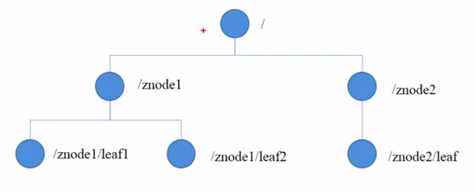

## Zookeeper学习
>Zookeeper是一个由Java编写并开源的,为分布式系统提供协调服务的框架.

### Zookeeper概述
>Zookeeper最早起源于雅虎研究院的一个小组.当时研究人员发现,在雅虎内部的很多系统基本都依赖一个类似的系统来进行分布式服务协调,
>但这些系统往往都存在分布式单点问题.所以雅虎的工程师试图开发一个无单点问题的分布式协调框架,以便让开发者集中精力在业务逻辑上.
>由于雅虎的内部项目都采用动物的名字命名,于是这个分布式协调框架便叫做Zookeeper.
>
>Zookeeper是一个典型的分布式数据一致性解决方案,分布式应用程序可以基于Zookeeper实现诸如:分布式协调/通知,集群管理,Master选举,
>分布式锁,分布式队列,命名服务,数据发布/订阅,负载均衡等功能.
>
>Zookeeper非常常用的一个场景是作为服务生产者和消费者的注册中心.服务生产者将自己提供的服务注册到Zookeeper,服务的消费者在进行服务
>调用时,先从Zookeeper获取服务生产者的信息,再调用服务生产者的数据和内容.
>
### Zookeeper特点
1. ZK本身就是一个分布式应用,只要保证半数以上的节点存活(5台有3台),ZK就可以正常服务.
2. ZK将数据保存在内存中,这也保证了高吞吐量和低延时,但内存的限制,也注定ZK节点存储的数据不能太大.
3. ZK有临时节点的概念.当创建临时节点的客户端会话一直保持活动时,瞬间节点就存在,而当会话结束,瞬间节点就会被删除.
   持久节点是指一旦ZNode被创建,除非主动移除,否则ZNode会一直保存在Zookeeper上.
4. ZK遵循分布式CP设计(Consistency,Partition Tolerance)

### Zookeeper数据结构
>ZK数据模型与Unix文件系统类似,整体上看是树型结构,每个节点称为ZNode.
>每个ZNode可以默认存储1MB数据.每个ZNode可以通过其唯一路径标识.

#### Zookeeper的目录节点类型:
1. PERSISTENT:持久化目录节点.客户端与该节点断开连接后,该节点目录依旧存在.
2. PERSISTENT_SEQUENTIAL:持久化顺序编号节点.客户端与该节点断开连接后,该节点依旧存在,只是ZK负责给该节点名称进行顺序编号.
3. EPHEMERAL: 临时目录节点.客户端与该节点断开连接后,该节点被删除.
4. EPHEMERAL_SEQUENTIAL: 临时顺序编号节点.客户端与该节点断开连接后,该节点被删除,只是ZK负责给该节点名称进行顺序编号.

### ZNode存储的数据
>每个ZNode维护着一个stat的数据结构,一个state只提供一个ZNode的元数据信息.它由版本号,操作控制列表(ACL),时间戳和数据长度组成

1. 版本号：每个ZNode都有一个版本号,当与ZNode相关的数据发生变化时,版本号也随之增加,当多个客户端一起对同一个ZNode的数据进行操作时,
    这个版本号的使用就非常重要了.(个人认为与JUC中解决ABA问题的做法相似)
2. 操作控制列表(ACL): ACL是访问ZNode的认证机制.它管理ZNode的读取与写入操作.
3. 时间戳: 时间戳表示ZNode被创建和修改ZNode经过的时间.它通常以毫秒为单位.
4. 数据长度: 存储在ZNode上的数据长度.每个ZNode最多允许1MB大小的数据.

### Session 会话
>ZK中的Session是指ZK服务端与客户端的会话.
>在客户端启动时,首先会与ZK建立一个TCP连接,从这个连接开始,客户端与服务端的会话也就开始了.通过这个连接,客户端能够通过心跳检测与ZK服务端
>保持有效的会话,也能够向ZK发送请求并接受ZK的响应,同时还能通过该连接接受来自ZK服务端的Watch事件通知.

>从ZK服务端的角度来看,会话对于ZK的操作是非常重要的.ZK会按FIFO先进先出的顺序处理Session中的请求.并且当客户端一开始连接到服务端的时候,ZK
>会向客户端分配Session ID(唯一).如果ZK在指定会话的超时时间内(minSessionTimeout,maxSessionTimeout)没有收到客户端的会话,则ZK会判定客户端
>死亡.

### Watches 监听
>客户端可以在访问ZNode时设置Watches,Watches会向注册的客户端发送任何ZNode更改的通知.
>也就是:当目录节点发生变化时(可能的情况有:目录节点被删除,数据被修改,子目录节点的修改等),ZK会通知客户端.

### Zookeeper高可用集群
>为了保证高可用,一般都会采用集群的方式来部署ZK应用,这样只要大部分ZK节点可用(允许部分机器故障),那么ZK服务就是可用的.
>客户端在使用ZK集群的时候,需要知道ZK集群的机器列表,通过与集群中的一台ZK机器建立TCP连接来使用服务，客户端使用这个TCP连接来
>发送请求,接受Watches事件以及发送心跳检测等.如果这个连接断开了,那么客户端可以连接到另一台ZK机器上.

>上图每个Server都是一台ZK服务器,每台Server都会在内部维护自己的服务器状态,并且每台Server间都保持着通信.集群间通过ZAB协议来
>保持数据的一致性.

#### Zookeeper集群角色
>Zookeeper没有采用传统的Master/Slave方式集群,而是使用了Leader,Follower,Observer三种角色.
>
>集群中的机器通过一个Leader的选举过程来选定一台Leader机器.Leader既可以为客户端提供读服务也可以为客户端提供写服务,而
>Follower和Observer只能提供读服务,但是可以接受写请求,并将写请求转发给Leader.Follower和Observer最大的区别就是:Follower参与选举Leader的过程,而Observer不参与.
>Observer的主要目的是为了扩展系统,提高读取速度.

#### 为什么Zookeeper集群要求节点数量为奇数个?
##### Zookeeper的选举要求是：要求可用节点的数量 > 总节点数量/2(注意是 >,也就是超过半数 ,不是 >=).

##### 什么是脑裂?
>脑裂通常发生在集群节点之间的通信不可达的情况,在这种情况下,集群会分裂成不同的小集群，小集群又会选出自己的Leader节点，导致
>原有的大集群出现多个Leader节点.

###### 例:
1. 如果原集群有4个节点:
>那么如果发生脑裂有大致2种情况:(假设脑裂成A,B两个小集群)

>(1).A集群有1个节点,B集群有3个节点,或A,B互换.      (A,B都有可能选出Leader,所以此情况可用)
>(2).A集群有2个节点,B集群有2个节点,或A,B互换.      (A,B都选不出Leader, 所以此情况不可用)

2. 如果原集群有5个节点:
>那么如果发生脑裂大致有2种情况:(假设脑裂成A,B两个小集群)

>(1).A集群1个节点,B集群有4个节点，或A,B互换.       (A,B都有可能选出Leader,所以此情况可用)
>(2).A集群2个几点,B集群有3个节点，或A,B互换.       (A,B都有可能选出Leader,所以此情况可用)

从以上2中假设来分析,显然集群节点为奇数个比偶数个有更加高的可用性.并且,假设如果原集群有3个节点,那么显然跟4个节点的可用性是
一样的，而且3台节点更加节省资源.综合以上原因,要求ZK集群为奇数台是非常正确的.

### Zookeeper ZAB协议与Paxos算法
>Paxos算法用于构建一个分布式的一致性状态机.
>ZAB算法用于构建一个高可用的分布式数据主备系统.

#### Paxos算法
>由于是初次接触分布式和ZK,所以尚且对Paxos算法不是特别熟悉,不过我Google到了一篇不错的文章,有对Paxos算法较为详细的
>介绍
>
[Paxos算法](https://developer.51cto.com/art/202001/609493.htm)

#### ZAB协议(Zookeeper Atomic Broadcast)
>ZAB协议是Zookeeper实现数据一致性的原子广播协议

#### ZAB包含２种模式:崩溃恢复模式和消息广播模式.
>当整个服务器在启动时,或者Leader服务器出现网络崩溃退出与重启等情况，ZAB就会处于崩溃恢复模式并选举新的Leader服务器.
>当选举产生了新的Leader服务器,并且集群中已经有过半节点与Leader服务器完成状态同步后,那么ZAB就退出崩溃恢复模式,进入消息广播模式.
>当有新的服务器加入到集群中,如果此时集群中已存在一台Leader服务器在进行消息广播,那么新加入的服务器就会自动进入数据恢复模式,找到Leader
>服务器,并与其一起进行数据同步,然后一起参与到消息广播流程中去.

以上流程总结为3个步骤:
1. 崩溃恢复.也就是选举新的Leader的过程
2. 数据同步.Leader与其他服务器进行数据同步.
3. 消息广播.Leader将数据发送给其他服务器.

